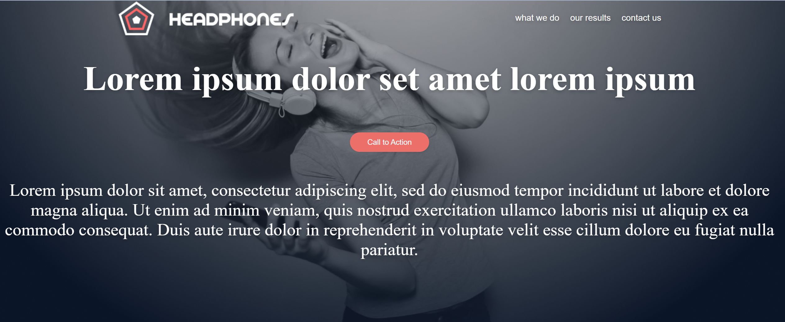

this is a recreation of the atlas headphones website from [this figma page](https://www.figma.com/design/FfnVADRC9xgI3yiZliTBYZ/Holberton-School---Headphone-company?node-id=0-1&p=f).

It uses a combination of HTML structure with CSS styling, and it is hosted on [github pages here](insert-link) 

The site is broken into 4 main segments:

The Header-

What we do-

Our results speak for themselves-

Contact us-

